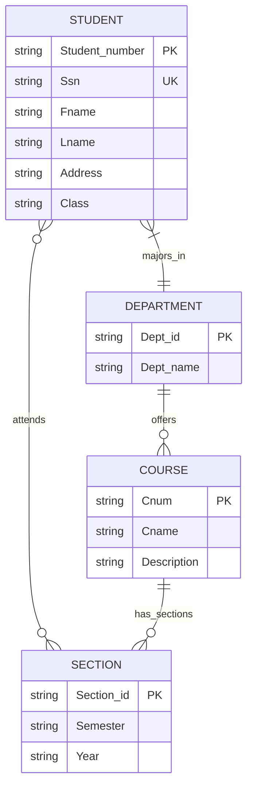
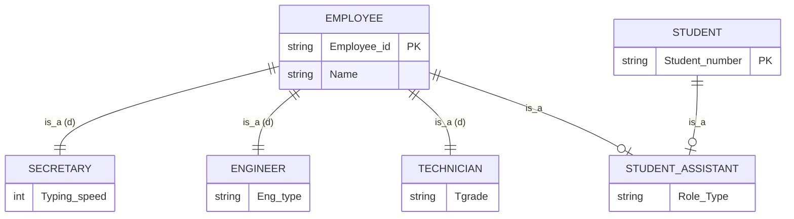
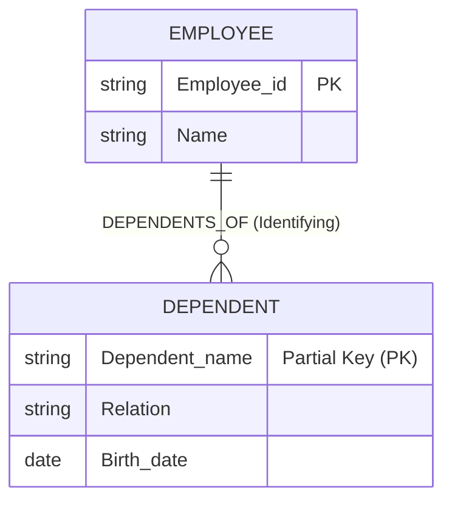

# DBMS Lab Assignment

## Part 1: Join Operations
These queries are formulated for the `EMPLOYEE`, `DEPARTMENT`, and `PROJECT` tables schema.

### 1. Retrieve the first name, last name, and department name of all employees who work for a department.
```sql
SELECT 
    e.first_name, 
    e.last_name, 
    d.department_name
FROM 
    EMPLOYEE e
JOIN 
    DEPARTMENT d ON e.department_id = d.department_id;
```

### 2. List all employees' last names and the names of the departments they manage. Include employees who do not manage any department.
```sql
SELECT 
    e.last_name, 
    d.department_name
FROM 
    EMPLOYEE e
LEFT JOIN 
    DEPARTMENT d ON e.employee_id = d.manager_id;
```

### 3. Combine each department with its locations using a natural join.
```sql
SELECT * 
FROM 
    DEPARTMENT 
NATURAL JOIN 
    DEPT_LOCATIONS;
```

### 4. For each employee, retrieve their first name and the first name of their immediate supervisor.
```sql
SELECT 
    e.first_name AS Employee_First_Name, 
    s.first_name AS Supervisor_First_Name
FROM 
    EMPLOYEE e
LEFT JOIN 
    EMPLOYEE s ON e.supervisor_id = s.employee_id;
```

### 5. For every project located in 'Stafford', list the project number, the controlling department number, and the department manager’s last name.
```sql
SELECT 
    p.project_number, 
    p.department_num, 
    e.last_name AS Manager_Last_Name
FROM 
    PROJECT p
JOIN 
    DEPARTMENT d ON p.department_num = d.department_number
JOIN 
    EMPLOYEE e ON d.manager_id = e.employee_id
WHERE 
    p.location = 'Stafford';
```

---

## Part 2: ER and EER Diagram

### 2.1 ER Diagram: UNIVERSITY Database
You can visualize the following design by pasting this Mermaid diagram code into [Mermaid Live](https://mermaid.live/), [Draw.io](https://app.diagrams.net/), or viewing it directly on GitHub.



### 2.2 EER: Advanced Employee System
This Enhanced ER model extends `EMPLOYEE` with specializations and multiple inheritance. The disjoint constraints (`d`) and total participation are conceptually indicated via inheritance relationships.


*Note: Mermaid's ER diagram native features lack complex specialization constraints notation natively like standard EER double-lines, so notations like `is_a (d)` and relationship lines dictate the constraints.*

---

## Part 3: Weak Entity Set Exercise

### DEPENDENT Entity
In this scenario, `DEPENDENT` acts as the weak entity set completely reliant on `EMPLOYEE` (the owner) through the identifying relationship `DEPENDENTS_OF`.


